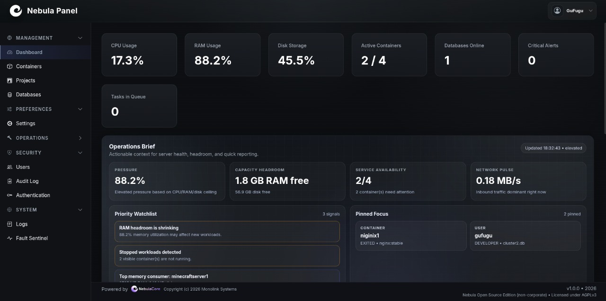
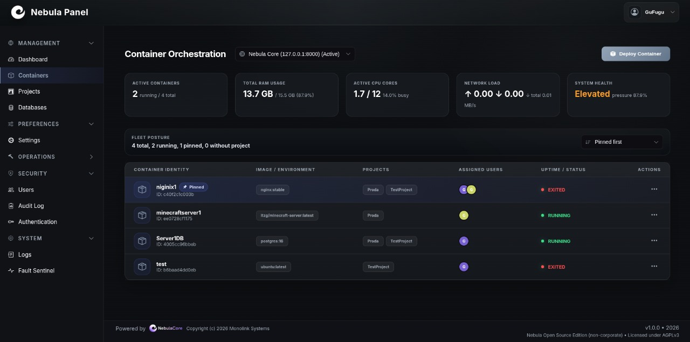
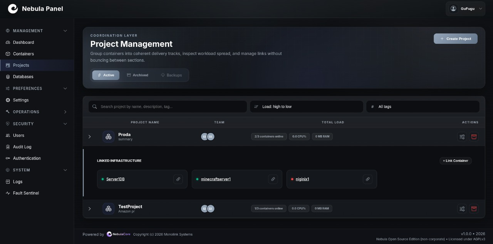
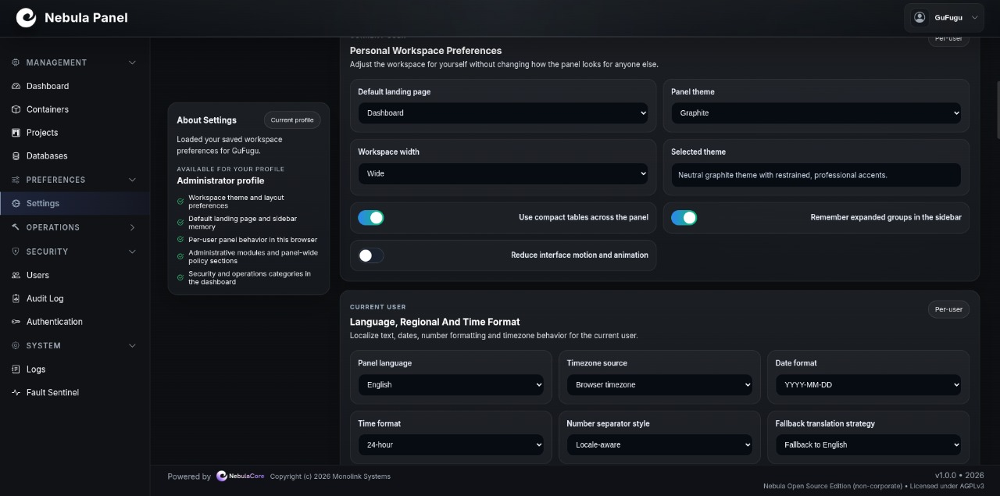

<p align="center">
  
</p>

# NebulaCore

NebulaCore is a pre-alpha control plane for single-host Docker environments. The repository combines:

- `nebula_core`: FastAPI backend, runtime services, RBAC, plugin host, Docker orchestration.
- `nebula_gui_flask`: Flask-based panel that proxies and visualizes the Core API.
- `install/`: installer, first-run bootstrap, Docker helper, and `systemd` automation.

Nebula is not production-ready yet, but the codebase already contains a clear foundation for:

- container lifecycle management
- user and identity management
- role-aware workspace permissions
- plugin runtime with process isolation
- multilingual GUI and switchable panel themes
- telemetry, logs, and project grouping

## Gallery






## What Is In This Repo

### Core stack

- `nebula_core/main.py` starts FastAPI, CORS, runtime services, and internal gRPC observability.
- `nebula_core/core/runtime.py` initializes the event bus, plugin manager, and background services.
- `nebula_core/services/docker_service.py` is the main Docker integration layer.
- `nebula_core/api/*.py` exposes HTTP and WebSocket endpoints for users, containers, projects, plugins, logs, and metrics.

### GUI stack

- `nebula_gui_flask/app.py` starts the Flask panel, Socket.IO updates, CSP handling, session support, and UI helpers.
- `nebula_gui_flask/core/bridge.py` authenticates against Core and proxies most panel requests to FastAPI.
- `nebula_gui_flask/static/js/i18n.js` handles locale discovery, fallback chains, DOM translation, and locale persistence.
- `nebula_gui_flask/static/panel_themes/*.json` define panel theme tokens.

### Data model

- `storage/databases/system.db`: system users, admin accounts, identity roles, identity tags, container access metadata, projects.
- `storage/databases/clients/*.db`: client/user databases for tenant-like user stores.
- `containers/presets/*.json`: deployment presets and default role-permission matrices.
- `storage/container_workspaces/`: managed container workspace directories when enabled by deployment profile.

## Important Reality Check

NebulaCore is still pre-alpha, but the install flow is now centered around one guided path for regular users on a single Linux host:

- `./panelctl.sh install` prepares Python, dependencies, `.env`, Core, GUI, and the first admin account.
- when `systemd` is available, the installer can set up both `nebula-core` and `nebula-gui` services automatically
- Docker can be checked and installed from the same installer flow
- `docker-compose.yml` is still not a real deployment stack today

The old manual multi-terminal flow still works for development, but it is no longer the primary path shown to new users.

## Architecture At A Glance

```text
Browser
  -> Flask GUI (`nebula_gui_flask`)
     -> Core HTTP API (`nebula_core`)
     -> Core internal gRPC observability
  -> FastAPI Core
     -> SQLite metadata (`system.db`, client DBs)
     -> Docker Engine
     -> Plugin Manager
        -> isolated plugin worker processes
```

## Security Model In Short

- Authentication uses signed session cookies named `nebula_session`.
- Staff users live in `system.db` and can access administrative routes.
- Regular users authenticate either in `system.db` or a client DB.
- Global identity metadata lives in `identity_roles` and `user_identity_tags`.
- Container access is controlled separately via:
  - explicit user-to-container assignments in `container_permissions`
  - role capability matrices in `container_role_permissions`
- Sensitive internal automation can also authenticate with `X-Nebula-Token: <NEBULA_INSTALLER_TOKEN>`.

Detailed explanation: [RBAC model](docs/RBAC_MODEL.md).

## Plugin System In Short

Nebula supports a plugin runtime with two modes:

- development-friendly in-process loading
- recommended process runtime with one worker process per plugin

The process runtime uses:

- `plugin.json` manifest
- `plugin.py` factory contract
- gRPC over Unix socket
- scoped plugin capabilities
- timeout, health check, restart, and crash tracking
- optional cgroup v2 resource isolation

Detailed explanation: [Plugin system docs](docs/PLUGIN_MANAGER_API.md).

## i18n And Theme System In Short

- GUI locales live in `nebula_gui_flask/static/locales/*.json`.
- `/api/i18n/catalog` is generated dynamically by scanning locale files and `_meta`.
- English is the fallback locale.
- Panel themes live in `nebula_gui_flask/static/panel_themes/*.json`.
- Theme choice is persisted per user in browser storage and applied through CSS variables and `<meta name="theme-color">`.

Detailed explanation: [GUI, i18n, and themes](docs/GUI_I18N_THEMES.md).

## Quick Start

### Recommended install

From the project root:

```bash
chmod +x panelctl.sh
./panelctl.sh install
```

The guided installer will:

- create `.venv`
- install Core + GUI Python dependencies
- generate a ready-to-use root `.env`
- check Docker and offer to install/start it
- install `nebula-core` and `nebula-gui` services when `systemd` is available
- create the first admin account

After installation, open:

```text
http://127.0.0.1:5000
```

### Daily commands

```bash
./panelctl.sh status
./panelctl.sh restart
./panelctl.sh logs
```

## Manual Development Start

If you want the old manual development flow instead of the guided installer:

```bash
python3 -m venv .venv
source .venv/bin/activate
pip install --upgrade pip
pip install -r requirements.txt
pip install -r nebula_gui_flask/requirements.txt
python -m nebula_core
```

In another terminal:

```bash
cd nebula_gui_flask
source ../.venv/bin/activate
python app.py
```

If no admin exists yet, run:

```bash
python install/main.py
```

Then choose `Easy install (recommended)` or `Create first admin`.

## systemd Service Flow

On Linux, the recommended service path is now Core + GUI together:

```bash
./panelctl.sh install
./panelctl.sh restart
./panelctl.sh status
./panelctl.sh logs
```

For Core-only administration, `./corectl.sh` still exists.

See [Core service guide](docs/CORE_SERVICE.md).

## Documentation Map

- [Architecture overview](docs/ARCHITECTURE.md)
- [RBAC and security model](docs/RBAC_MODEL.md)
- [Plugin system and Plugin Manager API](docs/PLUGIN_MANAGER_API.md)
- [GUI, i18n, and panel themes](docs/GUI_I18N_THEMES.md)
- [Docker, runtime, and deployment notes](docs/DOCKER_RUNTIME.md)
- [Core API reference](docs/API_DOCS.md)
- [Installer and bootstrap API](docs/CORE_INSTALL_API.md)

## Main Runtime URLs

- GUI: `http://127.0.0.1:5000`
- Core API: `http://127.0.0.1:8000`
- Internal gRPC observability: `127.0.0.1:50051` by default

## Environment Variables Worth Setting

- `NEBULA_SESSION_SECRET`
- `NEBULA_INSTALLER_TOKEN`
- `NEBULA_COOKIE_SECURE=true`
- `NEBULA_GUI_SECRET_KEY`
- `NEBULA_CORS_ORIGINS`
- `NEBULA_GUI_CORS_ORIGINS`
- `NEBULA_CORE_GRPC_PORT`

## License

Copyright (c) 2026 Monolink Systems

Nebula Open Source Edition (non-corporate) is licensed under AGPLv3. See `LICENSE`.
